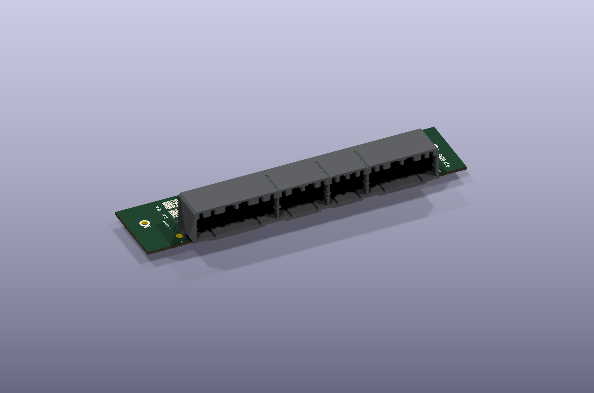

# TE-3-178780-6

Breakout board kicad design for OEM ECU connectors, applicable to toyota and suburu engines from late 1990s

26 pins (10 hi-current + 16 low-current) 174516-6

16 pins (all low current) 174514-6

12 pins (all low current) 174913-1

22 pins (6 hi-current + 16 low-current) 174515-6

## Connector 3D model

Open `174915-6.kicad_pcb` in KiCad and use **View → 3D Viewer** (Alt+3).
P25 now uses the project-local [STEP model](3dmodels/178780-1_reference.step),
replacing the missing `modules/c-0176122-06-f-3d_MM.wrl` reference.
No external model installation is required for this connector.

This is a **related 178780-1 family visual reference**, not a verified
manufacturer model for TE 3-178780-6. Pin and locating-hole alignment must be
checked against the purchased connector before using it for mechanical design.
See [model provenance and alignment](3dmodels/README.md).

